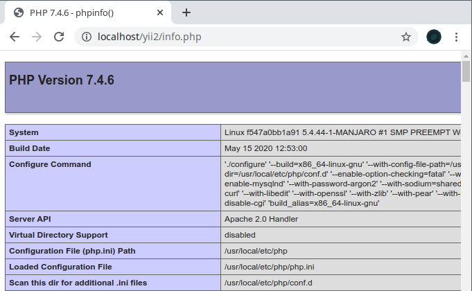
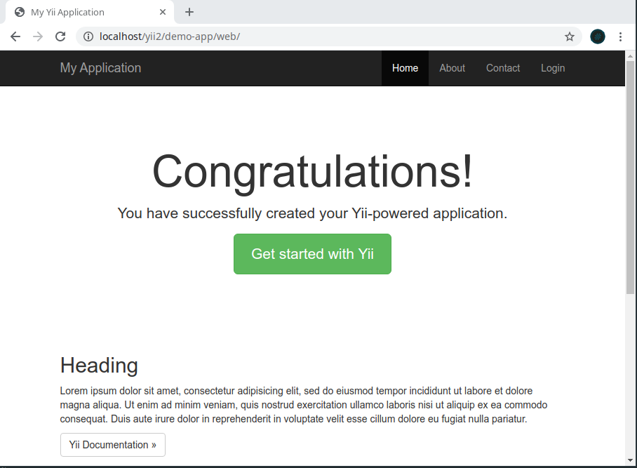
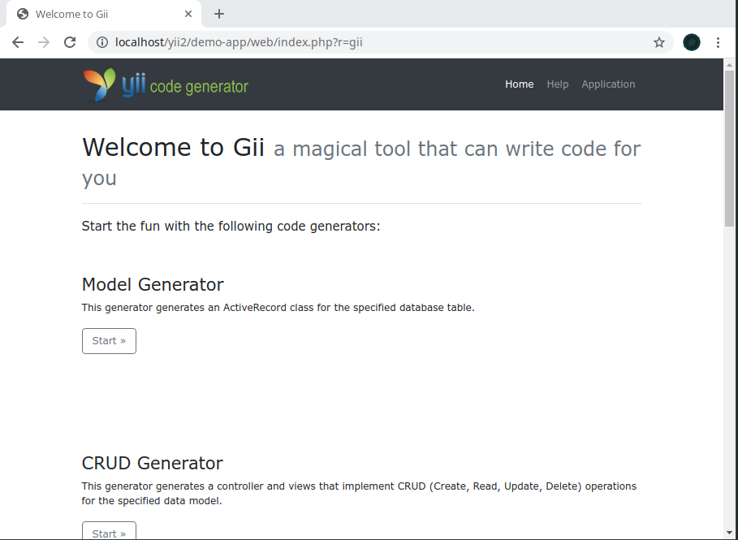

# Instalasi Yii-2 [ PART 1 ]

Ini adalah **Scratch of Part 1** yang artinya sebelum masuk ke bagian ini temen-temen harus baca dulu bagian **Scratch of Part 0** yaitu [The Overview](yii2-rapid-development-part-0.md).

Pada part ini saya akan menuliskan pengalaman saya dalam proses instalasi Yii-2. Karena ini based on experiance jadi saya harap temen-temen tidak hanya mengacu dengan coretan saya ini ya. Silahkan bisa ditambah dengan refrensi lainnya yang mungkin bisa menambah pemahaman anda. Ok, langsung saja berikut hal-hal yang akan kita lakukan di bagian ini:

## TODO

1. Check Requirement

   - [x] PHP Version > 7.1, etc
   - [x] Web Server Running
   - [x] Database Server Running

2. Instalasi composer
3. Instalasi Yii2 dengan composer
4. Konfigurasi Gii
5. Konfigurasi Database
6. CRUD dengan Gii

## 1. Check Requirement

Tahap pertama yang harus dilakukan adalah memastikan apakah requirement untuk menjalankan Yii app sudah terpenuhi semua.

### 1.1 PHP Version and It's Extension

Pertama check versi php anda terlebih dahulu, karena Yii yang akan kita gunakan membutuhkan PHP dengan versi diatas 7.1 maka pastikan PHP dan Ekstensi yang terinstall sudah terpenuhi. Gunakan perintah berikut untuk cek versi PHP dan Extensi yang tersedia

#### Check versi php

```bash
$ php -v
```

berikut output dari system saya:

```
PHP 7.4.6 (cli) (built: May 15 2020 12:54:14) ( NTS )
Copyright (c) The PHP Group
Zend Engine v3.4.0, Copyright (c) Zend Technologies
```

#### Check Extensions

```bash
$ php -m
```

berikut daftar module yang aktif di system saya

```
[PHP Modules]
Core
ctype
curl
date
dom
...
xml
xmlreader
xmlwriter
zip
zlib
```

dari sekian banyak modul/ekstensi yang ada, pastikan untuk modul untuk melakukan koneksi ke database sudah aktif. Karena saya menggunakan database `mysql` maka ekstensi saya yang aktif adalah `pdo_mysql, mysqli, mysqlnd`

### 1.2 Web Server

Requirement yang terahir pada part ini adalah pastikan Web Server sudah running. Untuk memastikannya disini saya akan arahkan browser saya ke alamat [localhost/yii2/info.php](https://127.0.0.1/info.php). Sebelumnya pastikan sudah ada file `info.php` di folder `yii2` pada root direktori anda. Berikut hirarki direktori saya

```
www
└── yii2
    └── info.php
```



## 2. Instalasi Composer

Untuk instalasi `composer` bisa merujuk ke halaman officialnya di [Install Composer](https://getcomposer.org/download/). Jangan lupa untuk memindah `composer` ke direktori `/usr/local/bin` (bagi pengguna GNU/Linux) agar bisa diakses langsung.

### Check versi composer

untuk memastikan composer berhasil terinstall, check versi composer

```bash
$ composer -V
Composer version 1.10.7 2020-06-03 10:03:56
```

## 3. Instalasi Yii2

Disini saya menggunakan template `yii2-app-basic` sebagai project awal. Untuk melakukan proses instalasi gunakan perintah berikut dan tunggu hingga proses instalasi selesai.

```bash
composer create-project --prefer-dist yiisoft/yii2-app-basic demo-app
```

Berikut struktur direktori saya setelah proses instalasi berhasil

```
www
└── yii2
    ├── demo-app
    │   ├── assets
    │   ├── codeception.yml
    │   ├── commands
    │   ├── composer.json
    │   ├── composer.lock
    │   ├── config
    │   ├── controllers
    │   ├── docker-compose.yml
    │   ├── LICENSE.md
    │   ├── mail
    │   ├── models
    │   ├── README.md
    │   ├── requirements.php
    │   ├── runtime
    │   ├── tests
    │   ├── vagrant
    │   ├── Vagrantfile
    │   ├── vendor
    │   ├── views
    │   ├── web
    │   ├── widgets
    │   ├── yii
    │   └── yii.bat
    └── info.php
```

buka browser dan arahkan ke alamat [localhost/yii2/demo-app/web/](http://localhost/yii2/demo-app/web/)

berikut tampilan awal dari project yang kita buat



## 4. Konfigurasi Gii

Gii merupakan fitur magic yang ada di Yii. Fitur ini merupakan Generator Code mulai dari Model, View, Controller, bahkan CRUD Generator. Untuk lebih lengkapnya bisa merujuk ke halaman resminya di [Memulai Gii](https://www.yiiframework.com/doc/guide/2.0/en/start-gii#starting-gii). Langsung saja kita seting Gii nya dengan merubah file `config/web.php`

```php
if (YII_ENV_DEV) {
    // configuration adjustments for 'dev' environment
    $config['bootstrap'][] = 'debug';
    $config['modules']['debug'] = [
        'class' => 'yii\debug\Module',
        // uncomment the following to add your IP if you are not connecting from localhost.
        //'allowedIPs' => ['127.0.0.1', '::1'],
    ];

    $config['bootstrap'][] = 'gii';
    $config['modules']['gii'] = [
        'class' => 'yii\gii\Module',
        // uncomment the following to add your IP if you are not connecting from localhost.
        'allowedIPs' => ['172.17.0.1', '::1'],
    ];
}
```

Perhatikn pada bagian `allowedIPs` jika temen-temen menggunakan proxy untuk serve webserver nya uncoment bagian ini untuk mengijinkan ip proxy dan set dengan ip proxy yang temen-temen gunakan. Disini saya menggunakan `nginx` sebagai proxy yang berada di IP `172.17.0.1`

Setelah itu coba buka Gii nya di alamat [localhost/yii2/demo-app/web/index.php?r=gii](http://localhost/yii2/demo-app/web/index.php?r=gii)



*NOTE: Disini kita tidak mencoba fitur Gii karena kita akan mencobanya setelah proses instalasi templete selesai*

**Semoga Bermanfaat :)**
